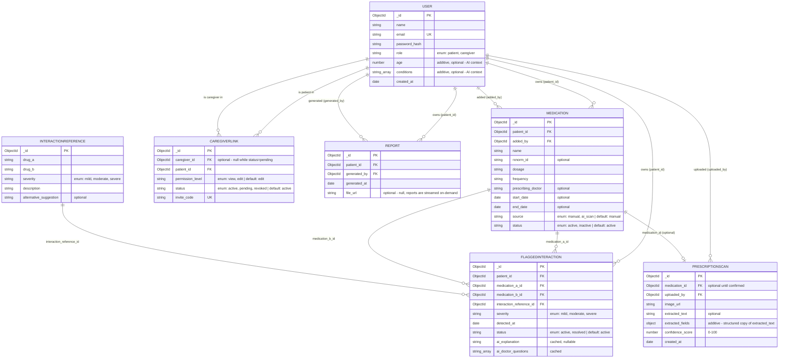

# MedGuard AI — Entity Relationship Diagram

Generated directly from the implemented Mongoose schemas (`backend/src/models/`), not
hand-drawn separately — so this is guaranteed to match the code, not drift from it. Every
field's required/optional status and type below is enforced by the schema and pinned by
`backend/tests/unit/models.schema.test.js` (19 tests, no database connection needed).

For the two places this diverges from the originally-specified data model, and why, see
`QA_AND_SCHEMA_AUDIT.md` section 4.

## Key relationships enforced in application code (not just the diagram)

- **CaregiverLink → access control**: every medication/interaction/report route re-checks
  an *active* `CaregiverLink` server-side (`patientContext.middleware.js`) — a caregiver
  can't reach a patient's data just by knowing their ID.
- **FlaggedInteraction has a compound unique index** on `(patient_id, medication_a_id,
  medication_b_id)` to prevent the same pair from being flagged twice — an index, not a
  visible field, so it doesn't appear as a column above but is enforced at the database
  level.
- **Medication → FlaggedInteraction is many-to-many in practice**: a single medication
  can appear as `medication_a_id` in one flag and `medication_b_id` in another, which is
  why the interaction engine checks a new medication against *every* other active
  medication, not just one.
